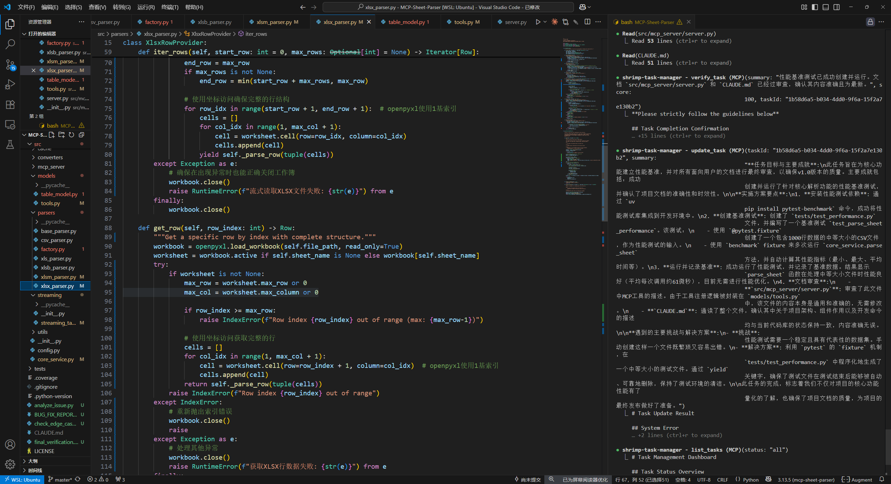

> ⚠️🔥 **重要提醒：当前版本Token消耗巨大，请谨慎使用！**
>
> 
> 作者也不知道为什么，正在找原因…… 🥲 作者穷，没用过claude官方key
> 作者最近才听说cc并使用, 所以很多cc的功能可能不知道


<div align="center">
  
</div>

# Claude Code Gemini

**让Claude Code使用Google Gemini API**

Claude Code Gemini是一个专门为Claude Code CLI设计的代理服务器，让您可以**无缝地将Claude Code切换到使用Google Gemini API**，同时享受Gemini的高级功能。


## 📝 创作动机

因为原项目我在使用gemini-balance的openai接口的时候, 感觉总是不使用工具,  怎么说都不用, 不知道是不是字段转化的问题, 而且很多gemini的高级功能可能都没有实现, 我就对原项目进行了自己的改版, 变成一个专注于gemini接口的代理,
> **原项目**: 本项目基于MIT开源项目进行了大幅修改。详见 [ATTRIBUTION.md](ATTRIBUTION.md)。

---

## 🎯 核心价值

**问题**: Claude Code默认使用Anthropic的Claude API，但您想使用Google的Gemini API

**解决方案**: Claude Code Gemini提供完美的API转换层，让Claude Code以为它在使用Claude API，实际上使用的是Gemini API

## ✨ 为什么选择Claude Code Gemini

- **🔄 零配置切换**: Claude Code无需任何修改，只需改变API端点
- **🚀 Gemini高级功能**: 享受函数并行调用、思考模式、智能推理等Gemini独有功能
- **💡 更智能的函数字段转换**: 解决了原有代理中LLM不主动调用工具的问题
- **⚡ 完整流式支持**: 实时响应，完整的Claude事件序列
- **🎨 多模态支持**: 图像处理能力（实验性）


## 🚀 快速开始

### 1. 环境准备

```bash
# 克隆项目
git clone https://github.com/yuqie6/claude-code-gemini.git
cd claude-code-gemini

# 安装依赖 (推荐使用UV)
uv sync

# 或使用pip
pip install -r requirements.txt
```

### 2. 配置设置

```bash
# 复制配置模板
cp .env.example .env

# 编辑配置文件
# 必需配置:
# GEMINI_API_KEY=your_gemini_api_key
# 可选配置:
# GEMINI_BASE_URL=custom_endpoint (如果使用自定义端点)
# BIG_MODEL=gemini-2.5-pro
# SMALL_MODEL=gemini-2.5-flash
```

### 3. 启动服务

```bash
# 直接运行
python -m src.main

# 或使用uv
uv run claude-code-gemini 
```

### 4. 让Claude Code使用Gemini

```bash
# 🎉 就是这么简单！Claude Code现在使用Gemini API了
ANTHROPIC_BASE_URL=http://localhost:8082 ANTHROPIC_API_KEY="any-key" claude

# 或者永久设置
# Linux/macOS (bash/zsh)
export ANTHROPIC_BASE_URL=http://localhost:8082
export ANTHROPIC_API_KEY="any-key"
claude

# Windows PowerShell
$env:ANTHROPIC_BASE_URL="http://localhost:8082"
$env:ANTHROPIC_API_KEY="any-key"

claude  # 现在Claude Code使用的是Gemini API
```

## ⚙️ 配置说明

### 必需配置
```bash
GEMINI_API_KEY="your-gemini-api-key"  
# 从 https://aistudio.google.com/app/apikey 获取
```

### 可选配置
```bash
# 模型映射
BIG_MODEL="gemini-2.5-pro"      # Claude sonnet/opus -> 此模型
SMALL_MODEL="gemini-2.5-flash"  # Claude haiku -> 此模型

# 自定义端点（如果需要）
GEMINI_BASE_URL="your-custom-endpoint"

# 服务器设置
PORT=8082
HOST="0.0.0.0"
```

### 获取Gemini API密钥

1. 访问 [Google AI Studio](https://aistudio.google.com/app/apikey)
2. 使用Google账号登录
3. 点击"Create API Key"
4. 将生成的密钥复制到 `.env` 文件


## 📜 项目来源与改进

本项目基于MIT开源项目进行了大幅修改和增强，专门为**Claude Code + Gemini**的完美结合而设计。

### 🎯 核心改进
- **解决函数调用问题**: 原项目中LLM不主动调用工具的问题得到解决
- **Gemini高级功能**: 函数并行调用、思考签名等Gemini独有功能
- **原生Gemini集成**: 专门针对Gemini API特性设计的转换层，而非简单的API转发, 确保Claude Code的大部分功能都能用gemini完美工作

**结果**: Claude Code用户现在可以使用谷圣的免费gemini-2.5-pro

详见 [ATTRIBUTION.md](ATTRIBUTION.md)。

## 📄 许可证

MIT License - 详见 [LICENSE](LICENSE) 文件。

## 🚩 已知问题与注意事项

### 1. Claude Code 兼容性
- 由于 Claude Code CLI 版本众多，部分旧版本可能不支持所有 Gemini 新特性，建议使用最新版 Claude Code。
- 某些命令行参数或环境变量格式在 Windows 与 Linux/macOS 下略有差异，详见上文“快速开始”。
- 思考内容目前还不清楚如何让 Claude Code 正确识别。尝试过加标签了

### 2. 工具/函数调用局限
- Gemini 的工具调用能力依赖于 prompt 设计和模型本身，极端复杂的工具链场景下，可能出现未主动调用或调用参数不全的情况。
- Claude Code 的工具描述与 Gemini 的 schema 存在一定差异，已做兼容处理，但极端自定义工具场景下仍可能有边界问题。
- Web 工具在我测试时存在问题，建议优先使用联网 mcp 而不是原生工具。

### 3. 多模态/图片支持
- 图片输入功能尚未完善，暂不建议依赖，后续会持续改进。

### 4. 端口与权限
- 默认监听 0.0.0.0:8082，若端口被占用请自行修改 .env 或启动参数。
- 某些云服务器或本地安全软件可能拦截 8082 端口访问。

### 5. 缓存
- 作者没有付费层级的 Gemini key，缓存相关功能未做充分测试。

### 6. Token 计算
- 现在的 token 计算可能有误差，请结合实际用量自行评估。

### 7. 其他注意事项
- ANTHROPIC_API_KEY 仅作占位，实际鉴权由 .env 中 GEMINI_API_KEY 决定。
- 本项目为魔改版，非官方产品，遇到问题欢迎提 issue 反馈。

如有更多兼容性或功能建议，欢迎在 GitHub issue 区留言！


